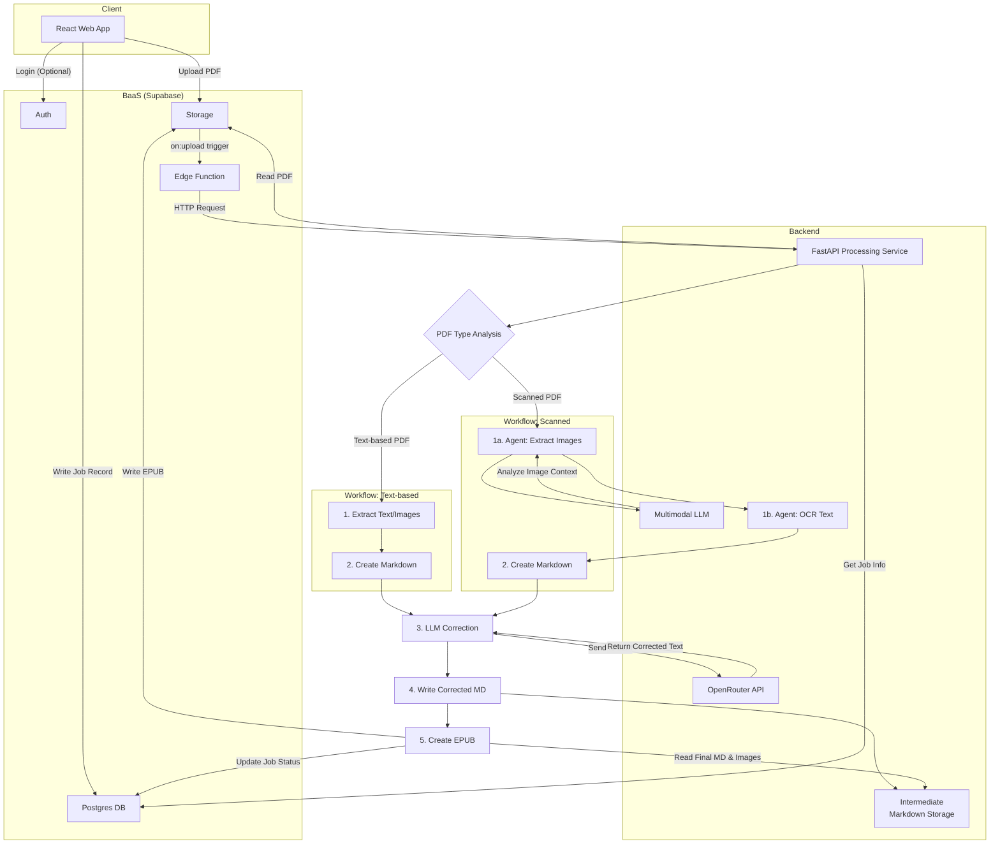

# 아키텍처 설계서 (MVP v2)

## 1. 개요
이 문서는 PDF to EPUB 변환 서비스의 아키텍처를 정의합니다. 사용자 등급(무료/유료)을 도입하고, LLM을 활용한 변환 품질 향상을 목표로 합니다.

## 2. 전체 아키텍처



### 데이터 흐름 (Data Flow)

1.  **사용자 및 파일 업로드**:
    *   **로그인 사용자**: React 앱에서 Supabase Auth로 인증합니다.
    *   **익명 사용자**: 별도 인증 없이 진행합니다.
    *   사용자는 PDF 파일을 Supabase Storage에 업로드하고, 클라이언트는 `conversion_jobs` 테이블에 작업 레코드를 생성합니다. (익명 사용자의 경우 `user_id`는 NULL, `session_id`에 클라이언트 생성 UUID 저장)

2.  **변환 작업 트리거**:
    *   Supabase Edge Function이 Storage 업로드 이벤트를 감지하여 FastAPI 처리 서비스의 API(`/convert`)를 호출합니다. 작업 ID(job_id)를 전달합니다.

3.  **FastAPI 처리 파이프라인**:
    1.  **PDF 분석**: 전달받은 `job_id`로 DB에서 작업 정보를 조회하고, PDF가 텍스트 기반인지 스캔본인지 분석합니다. 이 분석 결과에 따라 다음 두 가지 워크플로우 중 하나를 선택합니다.

    2.  **워크플로우 A: 텍스트 기반 PDF**
        1.  **1차 추출**: PDF에서 텍스트와 이미지를 직접 추출합니다.
        2.  **마크다운 생성**: 추출된 콘텐츠를 순서에 맞게 조합하여 초기 마크다운(.md) 파일을 생성하고 `Intermediate Storage`에 저장합니다.

    3.  **워크플로우 B: 스캔 기반 PDF (에이전트 모델)**
        1.  **에이전트 실행**: 스캔된 PDF 처리를 위한 에이전트를 실행합니다.
        2.  **이미지 처리**: 페이지 이미지를 추출하여 **멀티모달 LLM**에 전달, 이미지의 내용과 컨텍스트를 분석합니다.
        3.  **텍스트 처리**: **OCR 서비스**(예: PaddleOCR)를 통해 각 페이지에서 텍스트를 추출합니다.
        4.  **마크다운 생성**: 멀티모달 LLM의 분석 결과와 OCR 텍스트를 종합하여, 이미지와 텍스트가 의미적으로 올바른 순서로 배치된 초기 마크다운 파일을 생성하고 `Intermediate Storage`에 저장합니다.

    4.  **공통 파이프라인: 2차 보정 및 최종 생성**
        1.  **LLM 텍스트 보정**:
            *   **청크 분할**: 대용량 문서의 경우, LLM API의 토큰 제한 및 비용 효율성을 위해 마크다운 텍스트를 의미 있는 단위의 청크(Chunk)로 분할합니다.
            *   **API 호출**: 분할된 텍스트 청크를 **LLM API**에 순차적으로 전송하여, 끊어진 문맥을 잇고 오타를 수정하는 등 전체적인 가독성을 향상시킵니다.
        2.  **마크다운 업데이트**: 보정된 텍스트로 마크다운 파일을 업데이트합니다.
        3.  **EPUB 생성**: 최종적으로 보정된 마크다운 파일을 기반으로 EPUB 파일을 생성합니다.
        4.  **결과 저장 및 상태 업데이트**: 생성된 EPUB을 Supabase Storage에 업로드하고, `conversion_jobs` 테이블의 `epub_file_url`과 `status`('completed')를 업데이트합니다.

4.  **결과 확인**: React 앱은 Supabase Realtime으로 작업 상태 변경을 감지하고, 'completed' 상태가 되면 사용자에게 다운로드 링크를 제공합니다.

## 3. 컴포넌트 상세

### 3.1. 백엔드 서비스 (Supabase)
- **Database (PostgreSQL)**: 익명 사용자를 지원하도록 스키마가 확장됩니다. RLS 정책은 `user_id`가 일치하거나, `user_id`가 NULL이고 `session_id`가 일치하는 경우에만 접근을 허용하도록 수정됩니다.

### 3.2. 처리 서비스 (FastAPI)
- **역할**: LLM 연동을 포함한 전체 변환 파이프라인을 오케스트레이션합니다.
- **주요 기능**:
    - PDF 분석 및 마크다운으로 1차 변환.
    - **LLM 연동**: OpenRouter API와 통신하여 텍스트 보정.
    - 보정된 마크다운을 EPUB으로 최종 변환.

### 3.3. LLM API (OpenRouter)
- **역할**: 다양한 LLM 모델에 대한 단일 액세스 포인트를 제공하는 API 라우터입니다. 이를 통해 특정 작업에 가장 비용 효율적이거나 성능이 좋은 모델을 유연하게 선택하여 텍스트 보정 및 이미지 분석을 수행합니다.
- **엔드포인트**: `https://openrouter.ai/api/v1/chat/completions`

## 4. 데이터베이스 스키마 (Supabase)

```sql
-- 변환 작업을 관리하는 테이블
CREATE TABLE public.conversion_jobs (
    id UUID PRIMARY KEY DEFAULT gen_random_uuid(),
    user_id UUID REFERENCES auth.users(id) ON DELETE SET NULL, -- 익명 사용자를 위해 NULL 허용
    session_id TEXT, -- 익명 사용자를 위한 세션 식별자
    status TEXT NOT NULL DEFAULT 'pending' CHECK (status IN ('pending', 'analyzing', 'processing', 'correcting', 'generating', 'completed', 'failed')),
    progress INTEGER NOT NULL DEFAULT 0,
    file_name TEXT NOT NULL,
    file_size BIGINT NOT NULL,
    original_pdf_url TEXT,
    epub_file_url TEXT,
    intermediate_md_path TEXT, -- 중간 마크다운 파일 경로
    ocr_user_choice TEXT NOT NULL DEFAULT 'auto' CHECK (ocr_user_choice IN ('auto', 'force', 'off')), -- 사용자 OCR 선택
    llm_used BOOLEAN NOT NULL DEFAULT FALSE, -- LLM 보정 사용 여부
    error_message TEXT,
    created_at TIMESTAMPTZ NOT NULL DEFAULT NOW(),
    updated_at TIMESTAMPTZ NOT NULL DEFAULT NOW(),
    completed_at TIMESTAMPTZ
);

-- 익명 사용자 추적을 위한 session_id 인덱스
CREATE INDEX idx_jobs_session_id ON public.conversion_jobs (session_id);

-- Row Level Security (RLS) 활성화
ALTER TABLE public.conversion_jobs ENABLE ROW LEVEL SECURITY;

-- 정책: 로그인 사용자는 자신의 작업만, 익명 사용자는 자신의 세션 작업만 관리 가능
CREATE POLICY "User can manage their own conversion jobs"
ON public.conversion_jobs FOR ALL
USING (
  (auth.uid() = user_id) OR
  (user_id IS NULL AND session_id = current_setting('request.headers.x-session-id', true))
);

-- updated_at 필드 자동 갱신 트리거 (기존과 동일)
CREATE OR REPLACE FUNCTION public.handle_updated_at()
RETURNS TRIGGER AS $$
BEGIN
    NEW.updated_at = NOW();
    RETURN NEW;
END;
$$ LANGUAGE plpgsql;

CREATE TRIGGER set_updated_at
BEFORE UPDATE ON public.conversion_jobs
FOR EACH ROW EXECUTE FUNCTION public.handle_updated_at();
```

## 5. 보안 및 비용 관리
- **익명 사용자 접근**: 익명 사용자의 요청은 클라이언트에서 생성한 고유 `session_id`를 HTTP 헤더(`x-session-id`)에 담아 전송하고, RLS 정책을 통해 해당 세션 ID를 가진 작업에만 접근하도록 제한합니다.
- **API 비용 제어**:
    - 무료 사용자의 LLM 및 OCR API 호출 횟수와 사용량을 제한하는 로직을 FastAPI 서비스 내에 구현합니다.
    - 유료 사용자의 경우, 파일 크기와 실제 LLM/OCR 사용량을 기반으로 비용을 산정하는 모델을 적용하여 합리적인 과금을 책정합니다.
