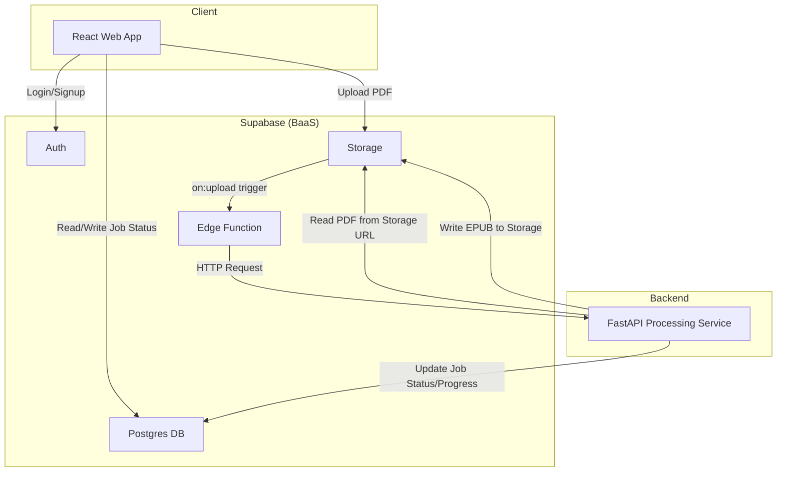

# 아키텍처 설계서 (MVP)

## 1. 개요
이 문서는 PDF를 EPUB으로 변환하는 서비스의 MVP(Minimum Viable Product) 아키텍처를 정의합니다. **React, FastAPI, Supabase**를 핵심 기술 스택으로 사용하여 개발을 간소화하고 확장성을 확보하는 것을 목표로 합니다.

## 2. 전체 아키텍처



### 데이터 흐름 (Data Flow)

1.  **사용자 인증**: 사용자는 React 앱을 통해 Supabase Auth를 사용하여 회원가입 및 로그인을 처리합니다.
2.  **파일 업로드**: 인증된 사용자는 PDF 파일을 React 앱에서 Supabase Storage로 직접 업로드합니다.
3.  **작업 생성**: 파일이 업로드되면, 클라이언트는 `conversion_jobs` 테이블에 새로운 작업(job) 레코드를 생성합니다.
4.  **변환 요청 (Trigger)**: Supabase Storage에 파일이 업로드되거나, `conversion_jobs` 테이블에 새로운 행이 삽입되면, 이를 트리거로 Supabase Edge Function이 호출됩니다.
5.  **PDF 처리**: Edge Function은 변환 로직을 담고 있는 FastAPI 처리 서비스의 API를 호출합니다. 이때 PDF 파일의 Storage URL과 작업 ID를 전달합니다.
6.  **변환 실행**: FastAPI 서비스는 전달받은 URL로 PDF 파일을 다운로드하여 OCR 및 EPUB 변환을 실행합니다. 처리 과정에서 작업 상태와 진행률(`progress`)을 Supabase DB에 주기적으로 업데이트합니다.
7.  **결과 저장**: 변환이 완료되면, 생성된 EPUB 파일을 Supabase Storage에 업로드하고, `conversion_jobs` 테이블에 결과 파일의 URL과 함께 상태를 'completed'로 업데이트합니다.
8.  **결과 확인**: React 앱은 Supabase의 실시간 구독(Realtime Subscription) 기능을 사용하여 작업 상태 변경을 감지하고, 변환이 완료되면 사용자에게 다운로드 링크를 제공합니다.

## 3. 컴포넌트 상세

### 3.1. 프론트엔드 (React)
- **역할**: 사용자 인터페이스, Supabase와의 직접 통신.
- **주요 기능**:
    - Supabase JS Client를 이용한 인증 및 데이터 관리.
    - Supabase Storage로 파일 업로드.
    - 실시간 구독을 통한 변환 상태 모니터링.
- **기술 스택**: React, TypeScript, Vite, Supabase-js.

### 3.2. 백엔드 서비스 (Supabase)
- **역할**: 인증, 데이터베이스, 파일 저장, 서버리스 함수 실행 등 백엔드 인프라 제공.
- **주요 기능**:
    - **Auth**: 사용자 회원가입, 로그인, 세션 관리.
    - **Database (PostgreSQL)**: 작업 정보, 사용자 데이터, 로그 등 저장. RLS(Row Level Security)를 통해 데이터 접근 제어.
    - **Storage**: 원본 PDF 및 결과 EPUB 파일 저장.
    - **Edge Functions**: 스토리지 또는 DB 이벤트를 기반으로 FastAPI 처리 서비스를 호출하는 경량 로직 수행.

### 3.3. 처리 서비스 (FastAPI)
- **역할**: 실제 PDF to EPUB 변환 로직을 수행하는 컴퓨팅 집약적 서비스.
- **주요 기능**:
    - PDF 파싱 및 텍스트/이미지 추출.
    - PaddleOCR을 이용한 다국어(한/영) OCR 처리.
    - EPUB 파일 생성 및 검증.
- **기술 스택**: Python, FastAPI, PaddleOCR, ebooklib.
- **배포**: 독립적인 서버 또는 서버리스 환경(예: Google Cloud Run, AWS Fargate)에 배포하여 Supabase와 분리.

## 4. 데이터베이스 스키마 (Supabase)

`conversion_jobs` 테이블을 중심으로 사용자 정보와 작업 상태를 관리합니다.

```sql
-- 변환 작업을 관리하는 테이블
CREATE TABLE public.conversion_jobs (
    id UUID PRIMARY KEY DEFAULT gen_random_uuid(),
    user_id UUID REFERENCES auth.users(id) ON DELETE CASCADE NOT NULL,
    status TEXT NOT NULL DEFAULT 'pending' CHECK (status IN ('pending', 'processing', 'completed', 'failed')),
    progress INTEGER NOT NULL DEFAULT 0 CHECK (progress >= 0 AND progress <= 100),
    file_name TEXT NOT NULL,
    file_size BIGINT NOT NULL,
    original_pdf_url TEXT,  -- Supabase Storage 원본 PDF URL
    epub_file_url TEXT,     -- 생성된 EPUB 파일 URL
    language TEXT NOT NULL DEFAULT 'kor' CHECK (language IN ('kor', 'eng')), -- OCR 처리 언어
    ocr_used BOOLEAN NOT NULL DEFAULT FALSE,
    error_message TEXT,
    created_at TIMESTAMPTZ NOT NULL DEFAULT NOW(),
    updated_at TIMESTAMPTZ NOT NULL DEFAULT NOW(),
    completed_at TIMESTAMPTZ
);

-- Row Level Security (RLS) 활성화
ALTER TABLE public.conversion_jobs ENABLE ROW LEVEL SECURITY;

-- 정책: 사용자는 자신의 작업만 보고 생성/수정할 수 있다.
CREATE POLICY "User can manage their own conversion jobs"
ON public.conversion_jobs FOR ALL
USING (auth.uid() = user_id);

-- updated_at 필드 자동 갱신을 위한 트리거
CREATE OR REPLACE FUNCTION public.handle_updated_at()
RETURNS TRIGGER AS $$
BEGIN
    NEW.updated_at = NOW();
    RETURN NEW;
END;
$$ LANGUAGE plpgsql;

CREATE TRIGGER set_updated_at
BEFORE UPDATE ON public.conversion_jobs
FOR EACH ROW EXECUTE FUNCTION public.handle_updated_at();
```

## 5. 보안
- **인증**: 모든 API 요청은 Supabase Auth를 통해 발급된 JWT로 인증됩니다.
- **인가**: 데이터베이스 접근은 RLS 정책을 통해 엄격히 통제되며, 사용자는 자신의 데이터에만 접근할 수 있습니다.
- **파일 접근**: Supabase Storage의 파일은 서명된 URL(Signed URL) 또는 RLS와 연계된 정책을 통해 접근을 제어하여 허가된 사용자만 다운로드할 수 있도록 설정합니다.