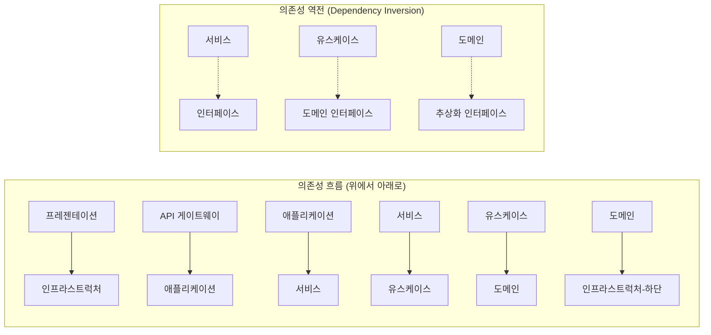
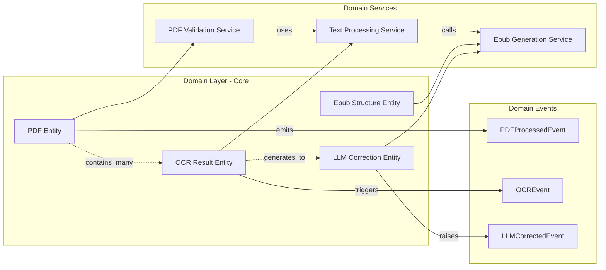
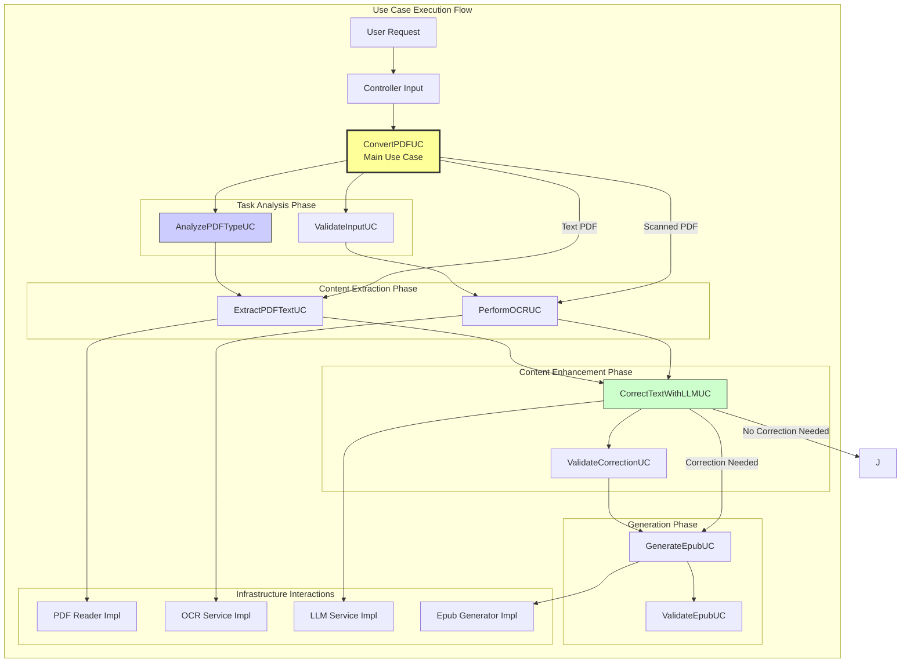
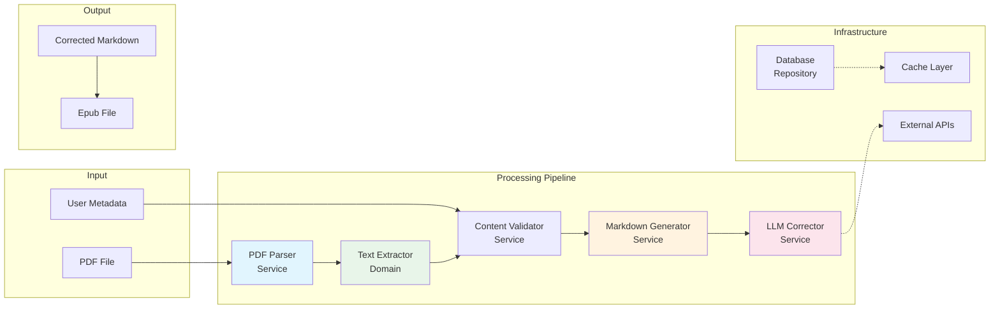
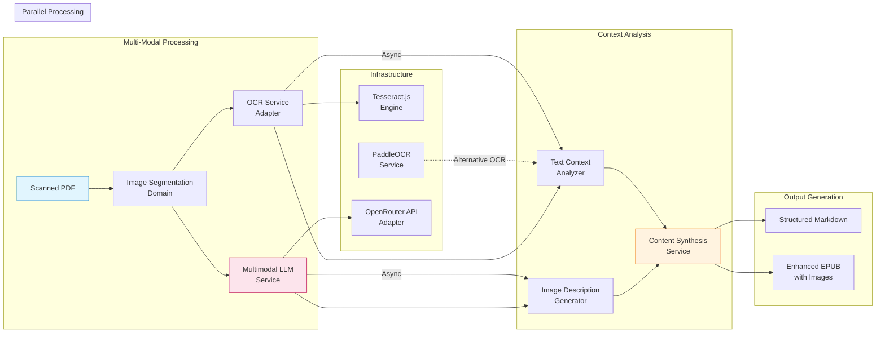
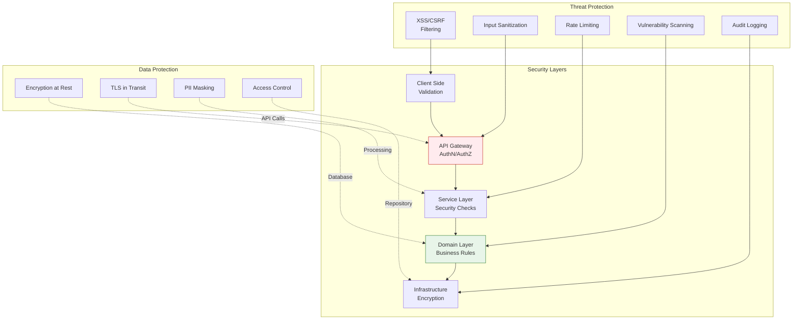
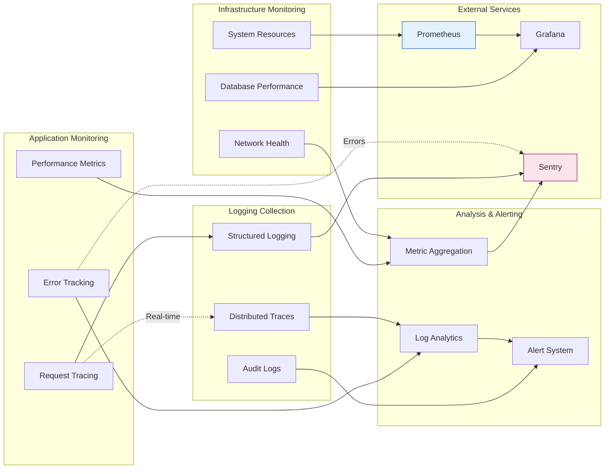
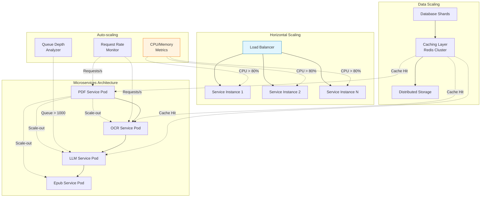

# 상세 아키텍처 다이어그램 (서비스/도메인 레이어 분리)

## 1. 아키텍처 개요

본 문서는 PDF to EPUB 변환 서비스의 상세 아키텍처를 다이어그램 형태로 정의합니다. 특히 서비스 레이어와 도메인 레이어의 분리를 명확히 하여 확장성과 유지보수성을 극대화하는 것을 목표로 합니다.

## 2. 전체 아키텍처 다이어그램

```mermaid
graph TB
    subgraph "프레젠테이션 레이어 (Presentation Layer)"
        A[React Web App]
    end

    subgraph "인프라스트럭처 레이어 (Infrastructure Layer)"
        B[Supabase Auth]
        C[Supabase Storage]
        D[PostgreSQL DB]
        E[Redis Cache]
        F[Monitoring<br/>Logging]
    end

    subgraph "API 게이트웨이 레이어 (API Gateway Layer)"
        G[FastAPI<br/>Application]
        H[Nginx/ALB<br/>Load Balancer]
    end

    subgraph "애플리케이션 레이어 (Application Layer)"
        I[API Router]
        J[Controller<br/>Layer]
    end

    subgraph "서비스 레이어 (Service Layer)"
        K[Conversion Orchestrator<br/>Main Service]
        L[PDF Analysis Service]
        M[OCR Processing Service]
        N[LLM Correction Service]
    end

    subgraph "도메인 레이어 (Domain Layer)"
        O[PDF Domain<br/>& Model]
        P[OCR Domain<br/>& Model]
        Q[LLM Domain<br/>& Model]
        R[Epub Domain<br/>& Model]
    end

    subgraph "유스케이스 레이어 (Use Case Layer)"
        S[ExtractPDFTextUC]
        T[PerformOCRUC]
        U[CorrectTextWithLLMUC]
        V[GenerateEpubUC]
        W[AnalyzePDFTypeUC]
    end

    subgraph "인프라스트럭처 레이어 (Infrastructure Layer)"
        X[PDF Reader<br/>Adapter]
        Y[Tesseract OCR<br/>Adapter]
        Z[PaddleOCR<br/>Adapter]
        AA[OpenAPI Adapter<br/>(LLM)]
        AB[EbookLib<br/>Adapter]
        AC[Database Repository]
    end

    %% 데이터 흐름 연결선
    A -- HTTP Request/Response --> H
    H -- API Calls --> G
    
    %% 클라이언트 <-> 인프라스트럭처
    B -- Auth Tokens --> F
    C -- File Upload/Download --> A
    
    %% API 게이트웨이 <-> 애플리케이션
    G -- Route Delegates --> I
    
    %% 애플리케이션 <-> 서비스
    I -- Executes --> J
    J -- Invokes Services --> K
    
    %% 서비스 <-> 유스케이스
    K -- Coordinates --> W
    L -- Implements --> S
    M -- Executes --> T
    N -- Processes --> U
    
    %% 유스케이스 <-> 도메인
    W -- Operates On --> O
    T -- Works With --> P
    U -- Uses --> Q
    
    %% 도메인 <-> 인프라스트럭처
    O -- Uses --> X
    P -- Uses --> Y & Z
    Q -- Interfaces With --> AA
    R -- Implemented By --> AB
    
    %% 인프라스트럭처 <-> 데이터베이스
    AC -- Persists --> D
    E -- Caches --> AC
    
    %% 모니터링 연결
    K --> F
    L --> F
    M --> F
    N --> F
    
    %% 캐시 연결
    K -- Uses Cache --> E
    
    subgraph "외부 서비스 (External Services)"
        AD[OpenRouter<br/>API]
        AE[PaddleOCR<br/>Service]
        AF[Tesseract.js<br/>Service]
    end
    
    %% 외부 서비스 연결
    AA -- Sends Requests --> AD
    Z -- Calls --> AE
    Y -- Invokes --> AF
```

## 3. 레이어별 상세 설명

### 3.1. 프레젠테이션 레이어 (Presentation Layer)
- **역할**: 사용자 인터페이스 표시 및 사용자 입력 처리
- **컴포넌트**:
  - React 컴포넌트 (Page, Layout, Form 등)
  - 상태 관리 (Context API + React Query)
  - 라우팅 시스템

### 3.2. 인프라스트럭처 레이어 (Infrastructure Layer)
- **역할**: 데이터 영속화, 외부 서비스 연동, 모니터링
- **주요 컴포넌트**:
  - 데이터베이스: PostgreSQL
  - 캐시: Redis
  - 파일 스토리지: Supabase Storage
  - 모니터링: Prometheus/Grafana, ELK Stack

### 3.3. API 게이트웨이 레이어 (API Gateway Layer)
- **역할**: 모든 API 요청의 진입점, 라우팅, 인증
- **주요 기능**:
  - 요청 라우팅 (FastAPI 애플리케이션)
  - 로드 밸런싱 (Nginx/ALB)
  - 레이트 리밋링
  - CORS 처리

### 3.4. 애플리케이션 레이어 (Application Layer)
- **역할**: HTTP 요청/응답 처리, 데이터 검증
- **주요 컴포넌트**:
  - API 라우터: 엔드포인트 매핑
  - 컨트롤러: HTTP 요청 도메인 오브젝트 변환

### 3.5. 서비스 레이어 (Service Layer)
- **역할**: 비즈니스 로직 오케스트레이션
- **주요 서비스**:
  - `Conversion Orchestrator`: 전체 변환 프로세스 조정
  - `PDF Analysis Service`: PDF 유형 분석 서비스
  - `OCR Processing Service`: OCR 처리 서비스
  - `LLM Correction Service`: LLM 기반 텍스트 보정 서비스

### 3.6. 도메인 레이어 (Domain Layer)
- **역할**: 핵심 비즈니스 로직 및 데이터 모델
- **도메인 객체**:
  - `PDF Domain`: PDF 관련 엔티티 및 비즈니스 규칙
  - `OCR Domain`: OCR 처리 관련 모델
  - `LLM Domain`: LLM 연동 도메인 객체
  - `Epub Domain`: EPUB 생성 관련 모델

### 3.7. 유스케이스 레이어 (Use Case Layer)
- **역할**: 특정 비즈니스 시나리오 구현
- **주요 유스케이스**:
  - `ExtractPDFTextUC`: PDF 텍스트 추출 유스케이스
  - `PerformOCRUC`: OCR 수행 유스케이스
  - `CorrectTextWithLLMUC`: LLM 텍스트 보정 유스케이스
  - `GenerateEpubUC`: EPUB 생성 유스케이스

### 3.8. 인프라스트럭처 레이어 (Infrastructure Layer - Bottom)
- **역할**: 외부 의존성 처리, 데이터 영속화
- **주요 어댑터**:
  - `PDF Reader Adapter`: 실제 PDF 라이브러리 연동
  - `OCR Adapters`: Tesseract.js, PaddleOCR 어댑터
  - `OpenAPI Adapter`: OpenRouter API 연동
  - `EbookLib Adapter`: EPUB 생성 라이브러리

## 4. 의존성 방향 (Dependency Flow)



## 5. 각 레이어의 세부 다이어그램

### 5.1. 서비스 레이어 상세 다이어그램 (TODO와 연계)

```mermaid
graph TB
    subgraph "Service Layer"
        K[Conversion Orchestrator<br/>(전체 프로세스 조정)]
        
        subgraph "Analysis Services"
            L1[PDF Type Analysis<br/>Service]
            L2[Content Validation<br/>Service]
        end
        
        subgraph "Processing Services"
            M1[Text Extraction Service<br/>(워크플로우 A)]
            M2[OCR Processing Service<br/>(에이전트 기반 처리)]
            M3[LLM Correction Service<br/>]
        end
        
        subgraph "Generation Services"
            N1[Markdown Generation<br/>Service]
            N2[Epub Creation Service<br/>(EPUB3 표준)]
        end
    end
    
    K --> L1
    K --> M2  <!-- 스캔 PDF 에이전트 기반 처리 -->
    K --> N1
    
    L1 --> M1  <!-- 텍스트 PDF: PyPDF2/pdfminer.six 연동 -->
    M1 --> N1
    M2 --> N1  <!-- 스캔 PDF: 결과 종합 후 마크다운 생성 -->
    N1 --> M3  <!-- LLM 텍스트 보정 적용 -->
    M3 --> N2
    
    subgraph "External Dependencies"
        O[PyPDF2/pdfminer.six<br/>PDF Reader]
        P[PaddleOCR<br/>OCR Engine]
        Q[Tesseract.js<br/>Alternative OCR]
        R[OpenRouter API<br/>LLM Service]
        S[ebooklib<br/>EPUB Generator]
    end
    
    M1 --> O
    M2 --> P & Q  <!-- 스캔 PDF: 여러 OCR 엔지니 지원 -->
    M3 --> R
    N2 --> S
    
    %% TODO와의 연계 표시
    subgraph "TODO 항목 연계"
        T1[워크플로우 A<br/>구현]
        T2[워크플로우 B<br/>에이전트 개발]
        T3[LLM 보정<br/>서비스]
    end
    
    K -.->|조정| T1 & T2
    M3 -.->|사용| T3
    
    %% 의존성 화살표 (단방향)
    style K fill:#f9f,stroke:#333,stroke-width:2px
    style L1 fill:#bbf,stroke:#333
    style M1 fill:#bfb,stroke:#333
    style M2 fill:#ffcdd2,stroke:#c62828
    style N1 fill:#fff3e0,stroke:#ef6c00
```

### 5.2. 도메인 레이어 상세 다이어그램



### 5.3. 유스케이스 흐름 다이어그램



## 6. 데이터 흐름 상세 다이어그램

### 6.1. 텍스트 PDF 변환 흐름



### 6.2. 스캔 PDF 변환 흐름



## 7. 보안 아키텍처 다이어그램



## 8. 모니터링 및 로깅 아키텍처



## 9. 확장성 아키텍처



## 10. 기술적 의사결정 요약

### 10.1. 레이어 분리의 장점
- **단일 책임 원칙**: 각 레이어가 명확한 역할을 수행
- **의존성 역전**: 하위 레이어 변경에 대한 영향 최소화
- **테스트 용이성**: 각 레이어별 독립적인 테스트 가능
- **확장성**: 특정 레이어만 확장하여 시스템 성능 향상

### 10.2. 핵심 설계 원칙
1. **의존성 방향**: 의도된 방향으로만 의존성이 흐름
2. **인터페이스 분리**: 클라이언트는 필요한 인터페이스만 사용
3. **개방-폐쇄 원칙**: 확장에는 열려있고, 수정에는 닫혀있음
4. **DIP 적용**: 고수준 모듈은 저수준 모듈에 의존하지 않음

### 10.3. 성능 고려사항
- **비동기 처리**: I/O 작업은 비동기로 처리하여 응답 시간 단축
- **캐 전략**: 자주 사용되는 데이터와 결과는 캐시하여 처리 속도 향상
- **분산 처리**: 컴퓨팅 집약적 작업은 분산하여 병렬 처리
- **리소스 풀링**: 데이터베이스 연결 등은 풀링하여 리소스 관리
