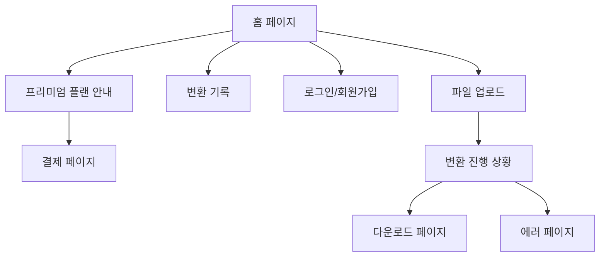

# PDF to EPUB 변환기 - UI 명세서

## 1. 개요

이 문서는 PDF to EPUB 변환기 웹 애플리케이션의 사용자 인터페이스를 상세히 정의합니다. 사용자 경험을 중심으로 각 화면의 레이아웃, 컴포넌트, 상호작용 방식을 기술합니다.

## 2. 전체 UI 구조



## 3. 디자인 시스템

### 3.1 색상 팔레트

| 용도             | 색상 코드 | 설명                           |
| ---------------- | --------- | ------------------------------ |
| 주요 색상        | #4A90E2   | 버튼, 링크 등 주요 액션에 사용 |
| 배경 색상        | #F5F7FA   | 전체 페이지 배경               |
| 텍스트 색상      | #333333   | 기본 텍스트                    |
| 보조 텍스트      | #666666   | 설명 텍스트                    |
| 성공 색상        | #7DBE80   | 성공 메시지                    |
| 경고 색상        | #F5A623   | 경고 메시지                    |
| 오류 색상        | #E74C3C   | 오류 메시지                    |
| 프리미엄 색상    | #FFD700   | 프리미엄 기능 표시             |
| 사용량 경고 색상 | #FF6B35   | 무료 사용량 제한 임박 표시     |
| 사용량 초과 색상 | #E74C3C   | 무료 사용량 초과 표시          |

### 3.2 타이포그래피

| 요소   | 폰트 크기 | 굵기    | 설명             |
| ------ | --------- | ------- | ---------------- |
| 제목 1 | 32px      | Bold    | 페이지 주요 제목 |
| 제목 2 | 24px      | Bold    | 섹션 제목        |
| 제목 3 | 18px      | Bold    | 소섹션 제목      |
| 본문   | 16px      | Regular | 일반 텍스트      |
| 설명   | 14px      | Regular | 보조 설명 텍스트 |

### 3.3 버튼 스타일

| 타입        | 배경 색상 | 텍스트 색상 | 테두리            | 설명                                   |
| ----------- | --------- | ----------- | ----------------- | -------------------------------------- |
| 기본        | #4A90E2   | #FFFFFF     | 없음              | 주요 액션 버튼                         |
| 보조        | #FFFFFF   | #4A90E2     | 1px solid #4A90E2 | 보조 액션 버튼                         |
| 경고        | #E74C3C   | #FFFFFF     | 없음              | 삭제 등 위험한 액션                    |
| 프리미엄    | #FFD700   | #000000     | 없음              | 프리미엄 기능 버튼                     |
| 사용량 경고 | #FF6B35   | #FFFFFF     | 없음              | 무료 사용량 제한 임박                  |
| 사용량 초과 | #E74C3C   | #FFFFFF     | 없음              | 무료 사용량 초과 시 프리미엄 전환 유도 |

## 4. 주요 화면 상세

### 4.1 홈 페이지 (무료 사용자)

#### 목적

사용자가 PDF to EPUB 변환 서비스를 시작할 수 있는 진입점 제공

#### 레이아웃

```
+---------------------------------------------------+
| 로고                    로그인/회원가입          |
+---------------------------------------------------+
|                                                   |
|              PDF to EPUB 변환기                  |
|            PDF를 EPUB으로 쉽게 변환하세요        |
|                                                   |
|              [PDF 파일 선택]                      |
|            또는 파일을 여기에 드래그하세요       |
|                                                   |
|  [무료 플랜]        [프리미엄 플랜 - $9.99/월]   |
|  - 최대 10MB 파일    - 최대 300MB 파일           |
|  - 기본 텍스트 추출  - 고급 OCR 기능              |
|  - 제한된 이미지 처리 - 고해상도 이미지 처리     |
|  - 기본 EPUB 생성    - LLM 문맥 연결 처리        |
|  - DeepSeek Free      - 무제한 LLM 사용          |
|                      - 광고 제거                 |
|
|  무료 사용량 현황                                |
|  [████████░░] 오늘 사용량: 80% (4/5회)          |
|  [프리미엄으로 업그레이드]                       |
|                                                   |
|  [광고 배너]                                      |
|                                                   |
|  최근 변환 기록                                   |
|  [변환된 파일 1] [변환된 파일 2] ...              |
|                                                   |
+---------------------------------------------------+
|  footer 정보                                       |
+---------------------------------------------------+
```

#### 컴포넌트

1. **헤더**
   - 로고: 좌측 상단에 애플리케이션 로고 표시
   - 사용자 메뉴: 우측 상단에 로그인/회원가입 또는 사용자 프로필 표시

2. **히어로 섹션**
   - 제목: "PDF to EPUB 변환기"
   - 설명: "PDF를 EPUB으로 쉽게 변환하세요"
   - 파일 업로드 버튼: "PDF 파일 선택" 버튼
   - 드래그 앤 드롭 영역: "또는 파일을 여기에 드래그하세요" 안내문

3. **플랜 비교**
   - 무료 플랜과 프리미엄 플랜의 기능 차이 표시
   - 프리미엄 플랜 선택 시 결제 페이지로 이동

4. **광고 배너**
   - Google AdSense 광고 표시
   - 변환 과정 중에도 광고 표시

5. **사용량 현황 (무료 사용자만)**
   - 일일 사용량 프로그레스 바
   - 남은 사용 횟수 표시 (예: "오늘 1회 남음")
   - 제한 임박 시 경고 메시지
   - 사용량 초과 시 프리미엄 업그레이드 버튼

6. **최근 변환 기록**
   - 제목: "최근 변환 기록"
   - 파일 목록: 최근에 변환된 EPUB 파일 목록 (최대 5개)
   - 각 항목: 파일명, 변환일시, 다운로드 버튼

7. **푸터**
   - 회사 정보, 연락처, 이용약관 링크 등

#### 상호작용

- "PDF 파일 선택" 버튼 클릭 시 파일 선택 다이얼로그 열림
- 드래그 앤 드롭 영역에 파일 드롭 시 업로드 시작
- 프리미엄 플랜 버튼 클릭 시 결제 페이지로 이동
- 최근 변환 기록의 다운로드 버튼 클릭 시 EPUB 파일 다운로드
- 사용량 프로그레스 바: 실시간 사용량 업데이트
- 제한 임박 시 (80% 이상): 경고 메시지 표시 및 프리미엄 업그레이드 버튼 강조
- 사용량 초과 시: 변환 시작 버튼 비활성화 및 프리미엄 전환 모달 표시

### 4.2 홈 페이지 (프리미엄 사용자)

#### 목적

프리미엄 사용자에게 광고 없이 깔끔한 인터페이스 제공

#### 레이아웃

```
+---------------------------------------------------+
| 로고                    사용자 프로필             |
+---------------------------------------------------+
|                                                   |
|              PDF to EPUB 변환기                  |
|            PDF를 EPUB으로 쉽게 변환하세요        |
|                                                   |
|              [PDF 파일 선택]                      |
|            또는 파일을 여기에 드래그하세요       |
|                                                   |
|  [프리미엄 플랜 활성화]                           |
|  - 최대 300MB 파일                                |
|  - 고급 OCR 기능 (영어/한글 지원)                |
|  - 고해상도 이미지 처리                          |
|  - LLM 문맥 연결 처리                            |
|  - 광고 제거                                     |
|                                                   |
|  최근 변환 기록                                   |
|  [변환된 파일 1] [변환된 파일 2] ...              |
|                                                   |
+---------------------------------------------------+
|  footer 정보                                       |
+---------------------------------------------------+
```

#### 컴포넌트

1. **헤더**
   - 로고: 좌측 상단에 애플리케이션 로고 표시
   - 사용자 프로필: 우측 상단에 사용자 이름 및 로그아웃 버튼

2. **히어로 섹션**
   - 제목: "PDF to EPUB 변환기"
   - 설명: "PDF를 EPUB으로 쉽게 변환하세요"
   - 파일 업로드 버튼: "PDF 파일 선택" 버튼
   - 드래그 앤 드롭 영역: "또는 파일을 여기에 드래그하세요" 안내문

3. **프리미엄 상태**
   - 현재 활성화된 프리미엄 플랜 정보 표시
   - 광고 제거된 깔끔한 인터페이스

4. **최근 변환 기록**
   - 제목: "최근 변환 기록"
   - 파일 목록: 최근에 변환된 EPUB 파일 목록 (최대 5개)
   - 각 항목: 파일명, 변환일시, 다운로드 버튼

### 4.3 파일 업로드 페이지 (무료 사용자)

#### 목적

사용자가 PDF 파일을 업로드하고 변환 옵션을 설정할 수 있도록 함. 로그인 없이 기본 변환 가능.

#### 레이아웃

```
+---------------------------------------------------+
| < 뒤로가기                 파일 업로드            |
+---------------------------------------------------+
|                                                   |
|  [게스트 모드 배지]                               |
|  로그인하지 않은 상태로 기본 변환 기능을         |
|  사용할 수 있습니다.                              |
|  [로그인] [프리미엄 알아보기]                     |
|                                                   |
|  [파일 아이콘] filename.pdf                       |
|  파일 크기: 5.2MB                                 |
|                                                   |
|  ⚠️ 프리미엄 기능                                  |
|  문맥 연결 처리, 고급 OCR, 고해상도 이미지는      |
|  프리미엄 플랜에서만 사용 가능합니다              |
|                                                   |
|  오늘 남은 무료 사용량: 1회                        |
|  [프리미엄으로 업그레이드하여 무제한 사용]         |
|                                                   |
|  [광고 배너]                                      |
|                                                   |
|              [변환 시작]                          |
|                                                   |
+---------------------------------------------------+
```

#### 컴포넌트

1. **헤더**
   - 뒤로가기 버튼: 홈 페이지로 이동
   - 제목: "파일 업로드"

2. **게스트 모드 알림**
   - 게스트 모드 배지 표시
   - 로그인하지 않은 상태 설명
   - 로그인 및 프리미엄 안내 버튼

3. **파일 정보**
   - 파일 아이콘
   - 파일명 표시
   - 파일 크기 표시

4. **프리미엄 기능 안내**
   - 프리미엄 기능에 대한 설명
   - 프리미엄 플랜 업그레이드 유도

5. **사용량 현황 (무료 사용자만)**
   - 오늘 남은 무료 사용 횟수 표시
   - 사용량 초과 시 프리미엄 업그레이드 버튼
   - 실시간 사용량 업데이트

6. **광고 배너**
   - 변환 과정 중에도 광고 표시

7. **액션 버튼**
   - "변환 시작" 버튼

#### 상호작용

- "변환 시작" 버튼 클릭 시:
  - 무료 사용량 확인
  - 사용량 남았을 경우: 변환 진행 상황 페이지로 이동
  - 사용량 초과 시: 프리미엄 업그레이드 모달 표시
  - **프리미엄 기능 선택 시: 자동 로그인 페이지로 리다이렉트**
- 실시간 사용량 업데이트 표시
- 프리미엄 업그레이드 버튼 클릭 시 결제 페이지로 이동
- **로그인 없이 기본 변환 가능**

### 4.4 파일 업로드 페이지 (프리미엄 사용자)

#### 목적

프리미엄 사용자에게 고급 옵션을 제공

#### 레이아웃

```
+---------------------------------------------------+
| < 뒤로가기                 파일 업로드            |
+---------------------------------------------------+
|                                                   |
|  [파일 아이콘] filename.pdf                       |
|  파일 크기: 5.2MB                                 |
|                                                   |
|  변환 옵션                                        |
|  [✓] 문맥 연결 처리 사용 (기본값: 켜짐)          |
|      처리 강도: [●○○○○]                          |
|  [✓] 고급 OCR 사용 (기본값: 켜짐)                |
|  [✓] 고해상도 이미지 처리 (기본값: 켜짐)         |
|  [ ] 고급 옵션 보기                               |
|                                                   |
|  고급 옵션 (펼쳐졌을 때)                          |
|  제목: [_________________________]                |
|  저자: [_________________________]                |
|  언어: [한국어 v]                                 |
|                                                   |
|              [변환 시작]                          |
|                                                   |
+---------------------------------------------------+
```

#### 컴포넌트

1. **헤더**
   - 뒤로가기 버튼: 홈 페이지로 이동
   - 제목: "파일 업로드"

2. **파일 정보**
   - 파일 아이콘
   - 파일명 표시
   - 파일 크기 표시

3. **변환 옵션**
   - 문맥 연결 처리 체크박스 (기본 활성화)
   - 처리 강도 슬라이더 (1-5 단계)
   - 고급 OCR 체크박스 (기본 활성화)
   - 고해상도 이미지 처리 체크박스 (기본 활성화)
   - 고급 옵션 토글

4. **고급 옵션**
   - 제목 입력 필드
   - 저자 입력 필드
   - 언어 선택 드롭다운

5. **액션 버튼**
   - "변환 시작" 버튼

#### 상호작용

- 각 옵션 체크박스 토글 가능
- 처리 강도 슬라이더 조절 가능
- 고급 옵션 토글 클릭 시 고급 옵션 섹션 펼쳐짐/접힘
- "변환 시작" 버튼 클릭 시 변환 진행 상황 페이지로 이동

### 4.5 프리미엄 플랜 안내 페이지

#### 목적

사용자에게 프리미엄 플랜의 기능과 가격을 안내하고 결제를 유도함

#### 레이아웃

```
+---------------------------------------------------+
| < 뒤로가기                 프리미엄 플랜          |
+---------------------------------------------------+
|                                                   |
|  프리미엄 플랜으로 업그레이드하세요              |
|                                                   |
|  [프리미엄 플랜 - $9.99/월]                       |
|  - 최대 300MB 파일                                |
|  - 고급 OCR 기능 (영어/한글 지원)                |
|  - 고해상도 이미지 처리                          |
|  - LLM 문맥 연결 처리                            |
|  - 광고 제거                                     |
|  - 사용자 정의 메타데이터                        |
|                                                   |
|              [결제 페이지로 이동]                 |
|                                                   |
+---------------------------------------------------+
```

#### 컴포넌트

1. **헤더**
   - 뒤로가기 버튼: 홈 페이지로 이동
   - 제목: "프리미엄 플랜"

2. **콘텐츠**
   - 프리미엄 플랜 제목
   - 가격 정보 ($9.99/월)
   - 프리미엄 기능 목록
   - 결제 페이지로 이동 버튼

#### 상호작용

- "결제 페이지로 이동" 버튼 클릭 시 결제 페이지로 이동

### 4.6 결제 페이지

#### 목적

사용자가 Stripe를 통해 프리미엄 플랜을 결제할 수 있도록 함

#### 레이아웃

```
+---------------------------------------------------+
| < 뒤로가기                 결제                   |
+---------------------------------------------------+
|                                                   |
|  프리미엄 플랜 결제                              |
|                                                   |
|  이메일: user@example.com                        |
|                                                   |
|  카드 정보 입력                                  |
|  [카드 번호 입력 필드]                           |
|  [만료일] [CVC]                                  |
|                                                   |
|  결제 금액: $9.99/월                             |
|                                                   |
|              [결제하기]                          |
|                                                   |
+---------------------------------------------------+
```

#### 컴포넌트

1. **헤더**
   - 뒤로가기 버튼: 프리미엄 플랜 안내 페이지로 이동
   - 제목: "결제"

2. **콘텐츠**
   - 결제 제목
   - 사용자 이메일 표시
   - 카드 정보 입력 필드 (Stripe Elements 사용)
   - 결제 금액 표시
   - "결제하기" 버튼

#### 상호작용

- 카드 정보 입력 후 "결제하기" 버튼 클릭 시 Stripe 결제 프로세스 시작
- 결제 성공 시 홈 페이지로 이동하고 프리미엄 권한 부여
- 결제 실패 시 에러 메시지 표시

### 4.7 변환 진행 상황 페이지

#### 목적

사용자가 PDF 변환 과정의 진행 상황을 실시간으로 확인할 수 있도록 함

#### 레이아웃 (무료 사용자)

```
+---------------------------------------------------+
| < 취소                    변환 진행 상황         |
+---------------------------------------------------+
|                                                   |
|  [파일 아이콘] filename.pdf                       |
|                                                   |
|  진행 상황                                        |
|  [●] 파일 업로드 완료                             |
|  [●] 텍스트 추출 중... (3/5 페이지)              |
|  [●] DeepSeek Free 처리 중... (1K 토큰 사용)     |
|  [○] EPUB 생성                                   |
|                                                   |
|  진행률: [███████     ] 60%                       |
|  예상 완료 시간: 2분 15초                         |
|                                                   |
|  오늘 사용량: 4/5회 (DeepSeek Free)               |
|                                                   |
|  [광고 배너]                                      |
|                                                   |
+---------------------------------------------------+
```

#### 레이아웃 (프리미엄 사용자)

```
+---------------------------------------------------+
| < 취소                    변환 진행 상황         |
+---------------------------------------------------+
|                                                   |
|  [파일 아이콘] filename.pdf                       |
|                                                   |
|  진행 상황                                        |
|  [●] 파일 업로드 완료                             |
|  [●] 텍스트 추출 중... (3/5 페이지)              |
|  [●] OCR 처리 중...                              |
|  [●] DeepSeek 무제한 처리 중...                  |
|  [●] 이미지 추출 중...                            |
|  [○] EPUB 생성                                   |
|                                                   |
|  진행률: [███████     ] 60%                       |
|  예상 완료 시간: 2분 15초                         |
|                                                   |
|  프리미엄 플랜: 무제한 LLM 사용                  |
|                                                   |
+---------------------------------------------------+
```

#### 컴포넌트

1. **헤더**
   - 취소 버튼: 변환 프로세스를 중단하고 홈 페이지로 이동
   - 제목: "변환 진행 상황"

2. **파일 정보**
   - 파일 아이콘
   - 파일명 표시

3. **진행 상황**
   - 단계별 진행 상태 표시 (완료, 진행 중, 대기)
   - 진행률 바
   - 예상 완료 시간

4. **광고 (무료 사용자만)**
   - 변환 과정 중에도 광고 표시

#### 상호작용

- 취소 버튼 클릭 시 확인 다이얼로그 표시 후 홈 페이지로 이동
- 자동 새로고침을 통해 진행 상황 실시간 업데이트

### 4.8 다운로드 페이지

#### 목적

사용자가 변환된 EPUB 파일을 다운로드하고, 추가 작업을 수행할 수 있도록 함

#### 레이아웃

```
+---------------------------------------------------+
| 로고                    변환 완료                 |
+---------------------------------------------------+
|                                                   |
|  [체크 아이콘]                                    |
|  filename.epub 변환 완료!                         |
|                                                   |
|  파일 크기: 3.8MB                                 |
|  변환 시간: 45초                                  |
|                                                   |
|              [EPUB 다운로드]                      |
|                                                   |
|  다른 작업                                        |
|  [EPUB 정보 수정] [다른 PDF 변환]                |
|                                                   |
+---------------------------------------------------+
```

#### 컴포넌트

1. **헤더**
   - 로고
   - 제목: "변환 완료"

2. **성공 메시지**
   - 체크 아이콘
   - 파일명과 함께 "변환 완료!" 메시지 표시

3. **파일 정보**
   - 파일 크기
   - 변환 소요 시간

4. **액션 버튼**
   - "EPUB 다운로드" 버튼
   - "EPUB 정보 수정" 링크
   - "다른 PDF 변환" 링크

#### 상호작용

- "EPUB 다운로드" 버튼 클릭 시 EPUB 파일 다운로드 시작
- "EPUB 정보 수정" 링크 클릭 시 메타데이터 수정 모달 열림
- "다른 PDF 변환" 링크 클릭 시 홈 페이지로 이동

### 4.9 에러 페이지

#### 목적

변환 과정에서 오류가 발생했을 때 사용자에게 정보를 제공하고, 다음 단계를 안내함

#### 레이아웃

```
+---------------------------------------------------+
| 로고                    변환 오류                 |
+---------------------------------------------------+
|                                                   |
|  [경고 아이콘]                                    |
|  변환 중 오류가 발생했습니다                      |
|                                                   |
|  오류 메시지:                                     |
|  "PDF 파일이 손상되었거나 지원되지 않는 형식입니다"|
|                                                   |
|  오류 코드: ERR_001                               |
|                                                   |
|              [다른 파일 시도]                     |
|              [고객 지원 문의]                     |
|                                                   |
+---------------------------------------------------+
```

#### 컴포넌트

1. **헤더**
   - 로고
   - 제목: "변환 오류"

2. **오류 메시지**
   - 경고 아이콘
   - 오류 제목: "변환 중 오류가 발생했습니다"
   - 상세 오류 메시지
   - 오류 코드

3. **액션 버튼**
   - "다른 파일 시도" 버튼
   - "고객 지원 문의" 버튼

#### 상호작용

- "다른 파일 시도" 버튼 클릭 시 홈 페이지로 이동
- "고객 지원 문의" 버튼 클릭 시 고객 지원 페이지(외부 링크)로 이동

## 5. 광고 시스템

### 5.1 광고 배치 전략

#### 무료 사용자 광고 위치

1. **홈 페이지**
   - 메인 콘텐츠와 플랜 비교 사이
   - 푸터 위쪽

2. **파일 업로드 페이지**
   - 변환 옵션과 액션 버튼 사이
   - 페이지 하단

3. **변환 진행 상황 페이지**
   - 진행 상황 표시 아래
   - 예상 완료 시간 아래

4. **다운로드 페이지**
   - 성공 메시지와 파일 정보 사이
   - 액션 버튼 위쪽

### 5.2 광고 차단기 대응

#### 감지 및 대응 방식

- 광고 차단기 감지 스크립트 구현
- 광고가 차단된 경우 대체 콘텐츠 표시
- 프리미엄 플랜 업그레이드 유도 메시지 표시

#### 대체 콘텐츠 예시

```
"광고 차단기를 사용하고 계시네요!
광고 없이 서비스를 이용하려면 프리미엄 플랜을 고려해보세요."
```

## 6. 반응형 디자인

### 6.1 데스크탑 (1024px 이상)

- 전체 레이아웃 유지
- 사이드바 또는 추가 정보 패널 표시 가능
- 광고 배너 전체 너비 활용

### 6.2 태블릿 (768px - 1023px)

- 주요 컨텐츠 중앙 정렬
- 버튼 및 입력 필드 크기 조정
- 일부 정보 축소 표시
- 광고 배너 크기 조정

### 6.3 모바일 (767px 이하)

- 단일 열 레이아웃
- 버튼 전체 너비로 확장
- 드롭다운 메뉴를 통해 일부 옵션 숨김
- 터치에 최적화된 컴포넌트 크기
- 광고 배너 모바일 최적화

## 7. 접근성 고려사항

### 7.1 키보드 내비게이션

- 모든 인터랙티브 요소에 키보드 포커스 표시
- Tab 순서 논리적으로 구성
- Enter 키로 버튼 클릭 가능

### 7.2 스크린 리더 지원

- 모든 이미지에 대체 텍스트 제공
- 의미 있는 제목과 레이블 사용
- ARIA 속성 적절히 활용

### 7.3 색상 대비

- 텍스트와 배경 간 4.5:1 이상의 대비 비율 유지
- 색상만으로 정보를 전달하지 않음

### 7.4 광고 접근성

- 광고에 적절한 대체 텍스트 제공
- 광고 차단기 사용자를 위한 대체 콘텐츠 제공

이 UI 명세서는 프론트엔드 개발자의 작업 지침으로 사용되며, 디자인 및 기능 변경 시 업데이트됩니다.
